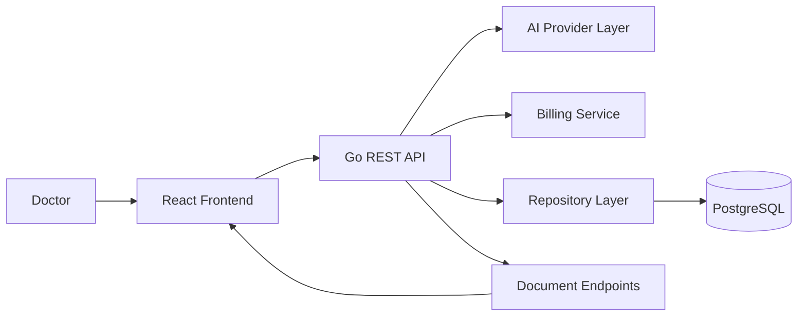
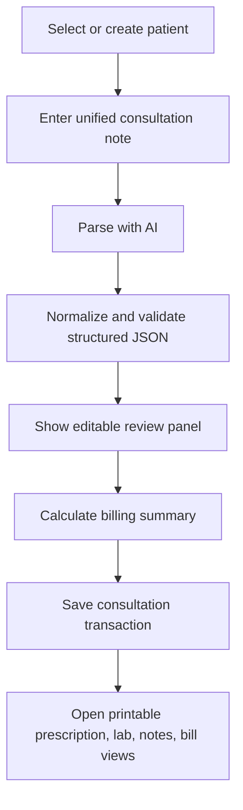
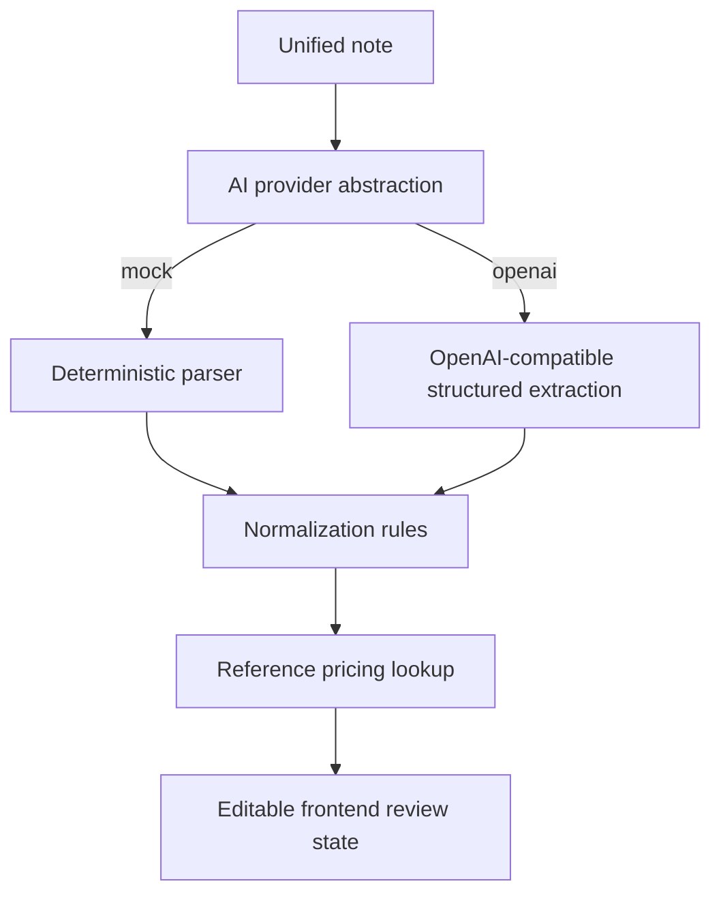
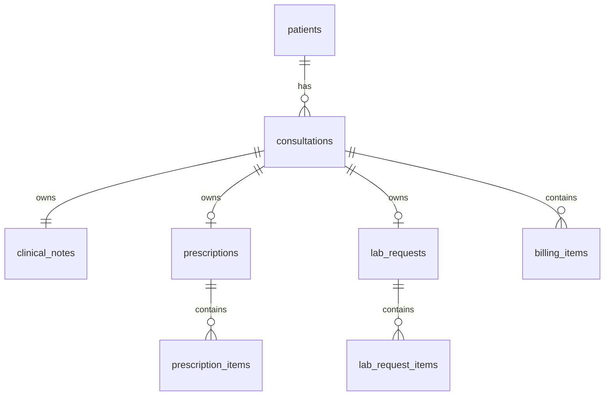

# System Design

## Problem Statement

ABC Health Clinic needs one consultation workspace where doctors can capture mixed narrative input once, classify it into medications, investigations, and notes with AI assistance, store the structured result, and produce operational outputs including the bill.

## Functional Requirements

- unified consultation input screen
- AI/NLP extraction of drugs, tests, and observations
- doctor review and edit before save
- structured PostgreSQL persistence
- prescription, lab request, notes, and bill outputs
- billing calculation using reference pricing and service fees

## Non-Functional Requirements

- easy local setup for assessors
- modular monolith architecture
- replaceable AI provider
- predictable demo mode without external AI keys
- print-friendly UI

## High-Level Architecture

## Consultation Workflow

## AI Parsing Flow

## Database Relationship Overview

## Design Notes

- The modular monolith keeps evaluation simple while preserving clean boundaries.
- AI parsing is intentionally separated from billing and persistence so model changes do not ripple through business logic.
- The mock provider keeps the project runnable without an API key, which matters in assessment review environments.
